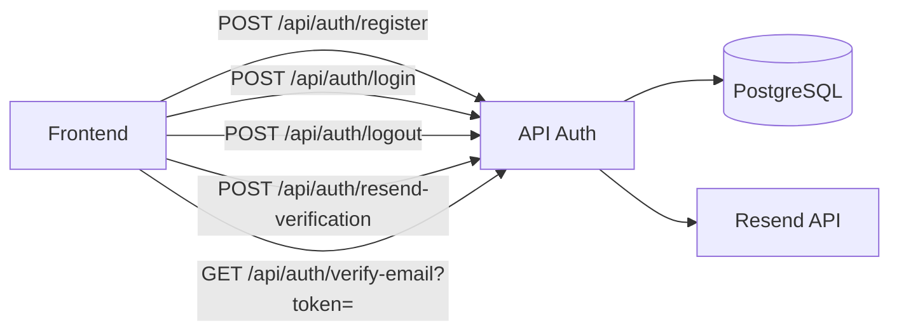

# Especificação Técnica - Sistema de Usuários (MVP)

| Campo | Valor |
| --- | --- |
| Tech Lead | @TBD |
| Time | @TBD |
| Epic/Ticket | TBD |
| Status | Draft |
| Criado em | 2026-03-02 |
| Última atualização | 2026-03-02 |
| Decisões clarificadas | 2026-03-02 (ver seção "Decisões e Clarificações") |

## Contexto

O Lécio atualmente não possui autenticação. O MVP permite gerar planos de aula sem vínculo a usuário. Esta especificação define o sistema de usuários mínimo para permitir cadastro, login e validação de email, alinhado ao stack existente (Next.js, Drizzle, Neon PostgreSQL) e preparando o terreno para funcionalidades futuras como histórico de planos por professor.

**Background**: O TDD original do Lécio MVP colocou "Login e histórico de planos por usuário" como fora do escopo. Esta spec detalha a extensão do produto com um módulo de autenticação simples.

**Domínio**: Autenticação e autorização de usuários em produto educacional.

**Stakeholders**: Professores (usuários finais), equipe de produto e engenharia.

---

## Definição do Problema e Motivação

### Problemas que estamos resolvendo

- **Identificação de usuários**: Não há hoje forma de associar planos gerados a um professor específico.
- **Validação de email**: Garantir que o email informado é válido e controlado pelo usuário.
- **Segurança de acesso**: Proteger a conta com senha seguindo boas práticas.

### Por que agora?

- Necessidade de viabilizar histórico de planos por usuário (V2).
- Pré-requisito para funcionalidades que exigem sessão autenticada.

### Impacto de não resolver

- **Negócio**: Impossibilidade de ofertas personalizadas e retenção baseada em uso.
- **Usuário**: Sem histórico, sem continuidade entre sessões.

---

## Escopo

### ✅ Em Escopo (MVP)

- Cadastro de usuário: nome, email, senha (com regras de senha segura).
- Login com email e senha (bloqueado até verificação de email).
- Validação de email via link enviado por Resend.
- Reenvio de email de verificação (invalida token antigo ao gerar novo).
- Logout (invalidação de sessão via cookie).
- Proteção de rotas: gerador de planos e listagem exigem autenticação.
- ORM: Drizzle (já utilizado no projeto).
- Serviço de email: Resend.
- Armazenamento: PostgreSQL (Neon).

### ❌ Fora do Escopo (V1)

- Login social (Google, Microsoft).
- Recuperação de senha (esqueci minha senha).
- 2FA / MFA.
- Refresh token ou estratégia avançada de sessão.
- Roles/permissões (RBAC).
- OAuth para integrações.

### 🔮 Considerações Futuras (V2+)

- Recuperação de senha.
- Login social.
- Vincular interações/planos existentes a usuários após migração.

---

## Solução Técnica

### Visão de Arquitetura

O fluxo de autenticação é controlado por APIs Next.js (Route Handlers), persistência via Drizzle no Neon PostgreSQL e envio de emails via Resend. A sessão será mantida via cookies HttpOnly com `jose`. Hash de senha com `bcrypt`.



### Componentes Principais

| Componente | Responsabilidade |
|------------|------------------|
| Tabela `users` | Dados do usuário (id, name, email, passwordHash, emailVerified, etc.) |
| Tabela `verification_tokens` | Tokens de verificação de email (token, userId, expiresAt) |
| API `/api/auth/register` | Cadastro, validação, hash de senha, envio de email de verificação |
| API `/api/auth/login` | Autenticação, emissão de sessão |
| API `/api/auth/verify-email` | Validação do token, atualização de `emailVerified` |
| API `/api/auth/resend-verification` | Reenvio de email de verificação (invalida token antigo) |
| API `/api/auth/logout` | Invalidação de sessão (cookie) |
| Serviço de email (Resend) | Envio do link de validação com token único |

### Fluxo de Cadastro

1. Usuário preenche nome, email e senha.
2. Validação de schema (Zod): formato de email, regras de senha.
3. Verificação de unicidade de email no banco.
4. Hash da senha (bcrypt).
5. Inserção do usuário com `emailVerified: false`.
6. Geração de token único (UUID ou similar), armazenado em `verification_tokens` com `expiresAt` (ex.: 24h).
7. Envio de email via Resend com link: `{APP_URL}/api/auth/verify-email?token={token}` (APP_URL em variável de ambiente).
8. Resposta de sucesso (sem expor o token na URL do frontend).

### Fluxo de Verificação de Email

1. Usuário clica no link recebido por email.
2. GET (ou POST) para `/api/auth/verify-email?token=...`.
3. Busca do token em `verification_tokens`, validação de expiração e vínculo com usuário.
4. Atualização de `users.emailVerified = true`, remoção/invalidação do token.
5. Redirecionamento para `/login?verified=1`. O frontend detecta o parâmetro e redireciona para o Lécio após confirmação.

### Fluxo de Login

1. Usuário envia email e senha.
2. Busca do usuário por email.
3. Verificação de senha (bcrypt/argon2).
4. **Obrigatório**: Verificação de `emailVerified`. Se `false`, retornar 403 e bloquear login até validação.
5. Criação de sessão (cookie HttpOnly, duração 7 dias) e retorno de sucesso.

### Regras de Senha Segura

| Regra | Exemplo |
|-------|---------|
| Mínimo de caracteres | 8 |
| Pelo menos uma letra maiúscula | A-Z |
| Pelo menos uma letra minúscula | a-z |
| Pelo menos um número | 0-9 |
| Pelo menos um caractere especial | !@#$%^&*(),.?;:[]{} |

Validação via Zod (regex ou `.refine()`).

### Regras do Campo Nome

| Regra | Valor |
|-------|-------|
| Mínimo de caracteres | 2 |
| Máximo de caracteres | 255 |
| Restrições | Sem emojis e sem caracteres especiais |

### Schemas de Banco (Drizzle)

**Tabela `users`**:

| Campo | Tipo | Observação |
|-------|------|------------|
| id | uuid | PK, default random |
| name | text | NOT NULL, 2–255 chars, sem emojis/caracteres especiais |
| email | text | NOT NULL, UNIQUE |
| passwordHash | text | NOT NULL |
| emailVerified | boolean | default false |
| createdAt | timestamp | default now |
| updatedAt | timestamp | default now |

**Tabela `verification_tokens`**:

| Campo | Tipo | Observação |
|-------|------|------------|
| id | uuid | PK, default random |
| token | text | UNIQUE, NOT NULL |
| userId | uuid | FK → users.id, ON DELETE CASCADE |
| expiresAt | timestamp | NOT NULL |

### Contratos de API

#### POST `/api/auth/register`

**Request**:

```json
{
  "name": "Maria Silva",
  "email": "maria@escola.gov.br",
  "password": "SenhaSegura123!"
}
```

**Response 201**:

```json
{
  "ok": true,
  "message": "Cadastro realizado. Verifique seu email para ativar a conta."
}
```

**Erros**: 400 (validação), 409 (email já cadastrado).

---

#### POST `/api/auth/login`

**Request**:

```json
{
  "email": "maria@escola.gov.br",
  "password": "SenhaSegura123!"
}
```

**Response 200**: Sessão definida via cookie. Body opcional:

```json
{
  "ok": true,
  "user": { "id": "...", "name": "...", "email": "..." }
}
```

**Erros**: 401 (credenciais inválidas), 403 (email não verificado).

---

#### POST `/api/auth/logout`

**Response 200**: Cookie de sessão invalidado. Body opcional:

```json
{
  "ok": true
}
```

---

#### POST `/api/auth/resend-verification`

**Request**: Body com `email` (email do usuário que solicitou reenvio).

**Response 200**:

```json
{
  "ok": true,
  "message": "Email de verificação reenviado."
}
```

**Regras**: Invalida token antigo em `verification_tokens` antes de gerar e enviar novo. Erros: 400 (email inválido), 404 (usuário não encontrado ou já verificado).

---

#### GET `/api/auth/verify-email?token={token}`

**Response 200**: Atualiza usuário, invalida token, redireciona para `/login?verified=1` ou similar.

**Erros**: 400 (token inválido/expirado), 404.

---

### Dependências Externas

| Dependência | Uso |
|-------------|-----|
| Resend | Envio de email transacional (link de validação) |
| bcrypt | Hash de senha |
| jose | Gerenciamento de sessão via cookie HttpOnly |

### Variáveis de Ambiente

| Variável | Uso |
|----------|-----|
| `APP_URL` | URL base da aplicação (ex.: `https://lecio.dimaior.net.br`) — usada nos links de verificação de email |
| `RESEND_API_KEY` | Chave da API Resend |
| `SESSION_SECRET` | Segredo para assinatura do cookie de sessão |

- **Nota**: `APP_URL` não existe no projeto hoje; deve ser criada e adicionada ao `.env.example`.

---

## Template de Email (Verificação)

**Remetente**: `noreply@lecio.dimaior.net.br`

O template segue o design system do projeto (paleta do CODE_GUIDELINE): `#33cc99` (green-500 CTA), `#28a37a` (green-600 hover), `#272727` (gray-800 texto primário), `#626263` (gray-500 texto secundário). Tipografia: Lexend Deca (ou fallback system font em clientes de email).

**Assunto**: Ative sua conta no Lécio

**Estrutura HTML sugerida**:

- Cabeçalho: "Lécio" (nome do produto).
- Saudação: "Olá {{name}}, clique no botão abaixo para ativar sua conta no Lécio."
- Botão CTA: "Ativar conta" — link {{verifyUrl}}, cor #33cc99.
- Texto secundário: "Se você não solicitou este cadastro, ignore este email."
- Fallback: link de verificação em texto, caso o botão não funcione em alguns clientes.
- Rodapé: "Lécio — planejamento de aulas para professores."

Placeholders: `{{name}}`, `{{verifyUrl}}`. Manter blocos curtos e legíveis conforme o CODE_GUIDELINE.

---

## Fluxo de Frontend (Rotas e UX)

| Rota | Descrição |
|------|-----------|
| `/login` | Formulário de login; suporta query `?verified=1` — ao detectar, mostra mensagem de sucesso e redireciona para o Lécio |
| `/cadastro` | Formulário de cadastro |
| Página pós-cadastro | "Verifique seu email" — informa que um link foi enviado e opção de reenviar |
| Página principal (Lécio) | Protegida; redireciona para `/login` se não autenticado |

**Fluxo resumido**: Cadastro → "Verifique seu email" → Usuário clica no link → `/api/auth/verify-email` redireciona para `/login?verified=1` → Frontend detecta e redireciona para o Lécio.

---

## Decisões e Clarificações (2026-03-02)

| # | Pergunta | Decisão |
|---|----------|---------|
| 1 | Bloquear login até verificação de email? | Sim, obrigatório. 403 se `emailVerified = false`. |
| 2 | Reenvio de email de verificação? | Sim, no escopo. Invalida token antigo ao gerar novo. |
| 3 | Variável para URL base dos links? | `APP_URL` — não existe, criar. |
| 4 | Gerador e listagem públicos ou privados? | Privados. Exigir autenticação. |
| 5 | Logout no MVP? | Sim. Endpoint POST `/api/auth/logout`. |
| 6 | bcrypt/argon2 e jose/iron-session? | bcrypt e jose. |
| 7 | Fluxo de frontend pós-cadastro e pós-verificação? | Pós-cadastro: tela "Verifique seu email". Verify-email redireciona para `/login?verified=1`; front verifica e redireciona para Lécio. |
| 8 | Regras do campo nome? | Min 2, max 255, sem emojis e sem caracteres especiais. |
| 9 | Rate limiting? | Fora do escopo do MVP. |
| 10 | Email de envio e template? | `noreply@lecio.dimaior.net.br`. Template conforme CODE_GUIDELINE. |
| 11 | Duração da sessão? | 7 dias. |

---

## Considerações de Segurança

### Autenticação e Autorização

- **Autenticação**: email + senha, sessão em cookie HttpOnly, Secure em produção.
- **Autorização**: MVP sem RBAC; toda requisição autenticada identifica o usuário via sessão.

### Proteção de Dados

- **Em trânsito**: HTTPS obrigatório.
- **Em repouso**: Senhas armazenadas apenas como hash (bcrypt), nunca em texto plano.
- **Secrets**: `RESEND_API_KEY`, `SESSION_SECRET`, `APP_URL` em variáveis de ambiente, nunca no código.

### Boas Práticas

- Validação de input em todos os endpoints (Zod).
- Proteção contra SQL injection (Drizzle com queries parametrizadas).
- Rate limiting: fora do escopo do MVP; considerar em V2.
- Tokens de verificação de uso único e com expiração curta (24h).
- Não retornar informações que permitam enumerar emails (ex.: "email já cadastrado" vs "credenciais inválidas" pode ser genérico para login, mas cadastro pode informar conflito para UX).

### PII e Compliance

- **PII coletada**: nome, email.
- **Base legal**: consentimento ao cadastrar.
- **Retenção**: enquanto a conta existir; considerar LGPD para direito de exclusão em V2.

---

## Riscos

| Risco | Impacto | Probabilidade | Mitigação |
|-------|---------|---------------|-----------|
| Resend indisponível | Médio | Baixa | Mensagem amigável ao usuário; retry configurado; fallback manual (reenviar email) |
| Tokens de verificação vazando | Alto | Baixa | Tokens únicos, expiração curta, uso único |
| Brute force em login | Alto | Média | Rate limiting, bloqueio temporário após N tentativas (V2) |
| Vazamento de senha em log | Alto | Baixa | Nunca logar senha ou token em texto plano |
| Migração de schema quebra app | Médio | Baixa | Migrations versionadas, testes em staging |

---

## Plano de Implementação

| Fase | Tarefa | Descrição | Estimativa |
|------|--------|-----------|------------|
| **1. Schema e migrations** | Criar tabelas | users, verification_tokens no Drizzle | 0.5d |
| | Configurar Drizzle | Gerar e aplicar migrations | 0.5d |
| **2. Cadastro** | Validação e hash | Schemas Zod, bcrypt/argon2 | 0.5d |
| | API register | POST /api/auth/register | 0.5d |
| | Integração Resend | Template de email, envio de link | 0.5d |
| **3. Verificação** | API verify-email | GET /api/auth/verify-email | 0.5d |
| **4. Login e Logout** | API login | POST /api/auth/login, sessão (7 dias) | 0.5d |
| | API logout | POST /api/auth/logout | 0.25d |
| | API resend-verification | POST /api/auth/resend-verification | 0.25d |
| **5. Frontend** | Páginas/componentes | Cadastro, login, "Verifique seu email", proteção de rotas (Lécio) | 1d |
| **6. Testes** | Testes automatizados | Unitários e integração das APIs | 1d |

**Total estimado**: ~5 dias úteis.

---

## Estratégia de Testes

| Tipo | Escopo | Abordagem |
|------|--------|-----------|
| Unitários | Validação de senha (Zod), hash | Vitest |
| Integração | APIs /register, /login, /verify-email | Vitest + supertest ou fetch, DB de teste |
| E2E (opcional) | Fluxo completo cadastro → verificação → login | Playwright ou similar |

### Cenários Críticos

- Cadastro com dados válidos → usuário criado, token gerado, email enviado.
- Cadastro com email duplicado → 409.
- Cadastro com senha fraca → 400.
- Login com credenciais corretas → sessão criada.
- Login com credenciais incorretas → 401.
- Verificação com token válido → emailVerified = true.
- Verificação com token expirado → 400.
- Login com email não verificado → 403.
- Logout → sessão invalidada.
- Reenvio de verificação → token antigo invalidado, novo email enviado.

---

## Dependências

| Dependência | Tipo | Observação |
|-------------|------|------------|
| Resend | Externa | API key necessária; domínio verificado para envio |
| Neon PostgreSQL | Infra | Já em uso |
| Drizzle | Projeto | Já em uso |
| bcrypt | Biblioteca | Hash de senha |
| jose | Biblioteca | Sessão baseada em cookie HttpOnly |

---

## Glossário

| Termo | Descrição |
|-------|-----------|
| **PII** | Informação que identifica pessoa (nome, email) |
| **Hash** | Função criptográfica unidirecional para senhas |
| **HttpOnly cookie** | Cookie não acessível via JavaScript, reduz risco de XSS |
| **Token de verificação** | String única usada uma vez para confirmar posse do email |
