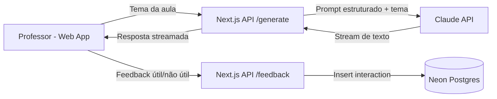

# TDD - Lécio MVP (Assistente de Planejamento de Aulas)

| Campo | Valor |
| --- | --- |
| Tech Lead | @TBD |
| Product Manager | @TBD |
| Time | @TBD |
| Epic/Ticket | TBD |
| Figma/Design | TBD |
| Status | Draft |
| Criado em | 2026-03-01 |
| Última atualização | 2026-03-01 |

## Contexto

O Lécio é um assistente de IA voltado a professores do Ensino Fundamental II e Médio, com foco em escolas públicas. O objetivo do MVP é transformar um único input de tema em um plano de aula completo e aplicável em sala, com estrutura pedagógica fixa em 6 seções obrigatórias.

O problema atual é operacional e pedagógico: planejamento de aula consome muito tempo, exige domínio de temas diversos e frequentemente resulta em improviso. A proposta do produto é reduzir esforço de preparação e aumentar a confiança do professor, mantendo qualidade e aderência a referências educacionais confiáveis (BNCC e obras clássicas conhecidas).

O escopo técnico já definido no projeto usa Next.js no frontend/backend, integração com Claude API via streaming e persistência de interações em Neon PostgreSQL com Drizzle. O fluxo prioriza rapidez de resposta percebida e legibilidade do conteúdo gerado.

Stakeholders principais: professores usuários do produto, equipe de engenharia, produto e operação da plataforma.

## Definição do Problema e Motivação

### Problemas que estamos resolvendo

- **Baixo tempo disponível para planejamento**:
  - Impacto: professores gastam horas em pesquisa e estruturação antes de cada aula.
- **Domínio heterogêneo dos temas da grade**:
  - Impacto: insegurança didática e maior risco de explicações superficiais.
- **Dificuldade de transformar conteúdo em aula executável**:
  - Impacto: planejamento burocrático, pouco escaneável e com baixa aplicabilidade imediata.

### Por que agora?

- O caso de uso é recorrente e com alta dor para o público-alvo.
- O MVP já possui premissas claras de arquitetura e critérios de sucesso definidos.
- Há oportunidade de validação rápida com métricas objetivas de utilidade percebida.

### Impacto de não resolver

- **Negócio**: menor tração e menor percepção de valor do produto educacional.
- **Técnico**: manutenção de fluxo manual sem instrumentação de feedback estruturado.
- **Usuário**: continuidade do esforço alto de planejamento e baixa padronização da aula.

## Escopo

### ✅ Em Escopo (V1 - MVP)

- Campo único para tema da aula e geração de plano por IA.
- Output sempre estruturado em 6 seções obrigatórias e na ordem definida.
- Streaming de resposta para reduzir tempo até primeiro conteúdo visível.
- Persistência de interações (tema, output, feedback binário) em banco.
- Interface responsiva com foco em mobile.

### ❌ Fora de Escopo (V1)

- Login e histórico de planos por usuário.
- Exportação em PDF.
- Dashboard analítico.
- Personalização avançada (série, duração, estilo de aula).
- Integrações com sistemas de secretaria.
- RAG/busca em tempo real.
- Editor avançado de texto.

### 🔮 Considerações Futuras (V2+)

- Histórico e reuso de planos por professor.
- Personalização de nível/série e tempo de aula.
- Integrações institucionais e analytics de uso.
- Possível estratégia de contexto adicional (RAG) para ampliar precisão.

## Solução Técnica

### Visão de Arquitetura

A solução adota arquitetura web full-stack em Next.js, com frontend de entrada/visualização, rotas de API para geração e feedback, integração com modelo Claude via backend e armazenamento em Neon PostgreSQL.

Componentes principais:

- **UI Web (Next.js + Tailwind)**: coleta tema, exibe 6 seções e captura feedback útil/não útil.
- **API `generate`**: valida input, aplica `SYSTEM_PROMPT` estruturado e retorna stream.
- **API `feedback`**: recebe avaliação do usuário e persiste junto da interação.
- **Camada de IA (`lib/claude`)**: centraliza modelo (atual: `claude-haiku-4-5`), tokens e contrato de prompt.
- **Camada de dados (Neon + Drizzle)**: armazena interações para análise qualitativa.

### Diagrama de Arquitetura

### Fluxo de Dados

1. Professor informa tema no frontend.
2. Frontend chama `POST /api/generate`.
3. Backend valida tema e envia requisição para Claude com `SYSTEM_PROMPT`.
4. Backend recebe stream e transmite ao cliente em tempo real.
5. Professor visualiza as 6 seções e envia feedback binário.
6. Backend persiste tema/output/feedback na tabela `interactions`.

### APIs e Endpoints

| Endpoint | Método | Descrição | Request | Response |
| --- | --- | --- | --- | --- |
| `/api/generate` | POST | Gera plano de aula via IA em streaming | `{ "topic": "..." }` | Stream textual do plano |
| `/api/feedback` | POST | Registra feedback da geração | `{ "topic": "...", "output": "...", "useful": true/false }` | `201`/`200` |

### Estruturas de Dados

Tabela principal:

- **`interactions`**
  - `id` (uuid, PK)
  - `topic` (text, not null)
  - `output` (text, not null)
  - `useful` (boolean, nullable)
  - `created_at` (timestamp, not null)

## Riscos

| Risco | Impacto | Probabilidade | Mitigação |
| --- | --- | --- | --- |
| Alucinação de referências bibliográficas | Alto | Médio | Prompt com regras rígidas, validação manual inicial e bateria de testes com temas reais |
| Conteúdo genérico ou pouco aplicável | Alto | Médio | Iteração de prompt por feedback, critérios de qualidade por seção, avaliação com professores |
| Tempo de resposta acima do esperado | Médio | Médio | Streaming obrigatório, monitorar latência P95 e ajustar payload/tokens |
| Dependência de provedor externo de LLM | Alto | Médio | Timeouts, tratamento de erro amigável, plano de fallback operacional |
| Baixa confiança do professor no output | Alto | Médio | Estrutura pedagógica previsível, reforço de fundamentação e transparência de limites |

## Plano de Implementação

| Fase | Tarefa | Descrição | Owner | Status | Estimativa |
| --- | --- | --- | --- | --- | --- |
| Fase 1 - Base | Estrutura Next.js e design system | Configurar layout, componentes base e tokens visuais | @TBD | TODO | 2d |
| Fase 1 - Base | Modelo de dados | Definir schema Drizzle e conexão Neon | @TBD | TODO | 1d |
| Fase 2 - Geração | Endpoint `/generate` com streaming | Integrar Claude API e contrato de prompt | @TBD | TODO | 3d |
| Fase 2 - Geração | Renderização das 6 seções | Exibir resposta de forma escaneável e navegável | @TBD | TODO | 2d |
| Fase 3 - Feedback | Endpoint `/feedback` | Persistir avaliação binária por interação | @TBD | TODO | 1d |
| Fase 4 - Qualidade | Testes e hardening | Cobertura de fluxos críticos, erros e performance | @TBD | TODO | 3d |
| Fase 5 - Go-live | Observabilidade e rollout | Alertas, métricas e publicação controlada | @TBD | TODO | 2d |

Estimativa total inicial: ~14 dias úteis.

## Considerações de Segurança

### Autenticação e Autorização

- No MVP sem login, endpoints expostos devem adotar proteção por rate limiting e validação estrita de payload.
- Evolução com autenticação de usuário deve restringir leitura/escrita de dados por escopo do próprio usuário.

### Proteção de Dados

- **Em trânsito**: TLS obrigatório em todo tráfego.
- **Segredos**: `ANTHROPIC_API_KEY` e credenciais de banco apenas no servidor, via variáveis de ambiente.
- **No frontend**: nunca expor chaves da API de LLM.

### Tratamento de dados e privacidade

- Não coletar PII além do necessário para operação do MVP.
- `topic` e `output` podem conter dados sensíveis inseridos pelo usuário: aplicar política de retenção e mascaramento em logs.
- Não registrar conteúdo sensível em logs de aplicação.

### Boas práticas

- Validação de entrada (`topic` obrigatório e com limite de tamanho).
- Sanitização de dados renderizados.
- Política de segredo sem versionamento em repositório.

## Estratégia de Testes

| Tipo de teste | Escopo | Meta | Abordagem |
| --- | --- | --- | --- |
| Unitário | Parsing/normalização, regras do hook e validações | > 80% em módulos críticos | Vitest/Jest |
| Integração | Endpoints `/generate` e `/feedback` com DB | Fluxos principais + falhas | Supertest + banco de teste |
| E2E | Jornada completa do professor | Happy path + erro de API externa | Playwright |
| Não-funcional | Latência e resiliência | RNF de resposta e estabilidade | Teste de carga e smoke contínuo |

Cenários críticos:

- Geração com tema válido retorna as 6 seções na ordem correta.
- Tema vazio ou acima do limite retorna erro amigável.
- Falha da API externa é tratada sem quebrar experiência.
- Feedback é persistido corretamente para análise posterior.

## Monitoramento e Observabilidade

### Métricas principais

| Métrica | Tipo | Limiar de alerta | Objetivo |
| --- | --- | --- | --- |
| `generate.first_chunk_latency_ms` | Latência | > 2000ms por 5 min | Primeiro conteúdo visível rápido |
| `generate.total_latency_p95` | Latência | > 8000ms por 5 min | Atender RNF de resposta |
| `generate.error_rate` | Erro | > 2% por 5 min | Detectar degradação |
| `feedback.positive_ratio` | Negócio | < 50% por janela | Validar valor percebido |
| `db.interactions.write_failures` | Erro | > 1% por 5 min | Garantir integridade de coleta |

### Logs estruturados

- Logar: request id, endpoint, duração, status, tipo de erro.
- Não logar: payload completo sensível, segredos e chaves.

### Alertas e operação

- Alerta crítico para erro alto em geração.
- Alerta alto para latência fora de alvo.
- Painel operacional com volume, latência, erros e taxa de feedback positivo.

## Plano de Rollback

### Estratégia de deploy

- Rollout progressivo por ambiente (dev -> staging -> produção).
- Liberação controlada por feature flag de geração, quando disponível.

### Gatilhos de rollback

| Gatilho | Ação |
| --- | --- |
| `generate.error_rate > 5%` por 5 min | Rollback imediato para versão anterior |
| `generate.total_latency_p95 > 10s` por 10 min | Investigar rapidamente e reverter se persistir |
| Falha crítica de persistência em `interactions` | Pausar escrita e reverter release |
| Regressão funcional nas 6 seções | Reverter deploy e abrir incidente |

### Passos de rollback

1. Reverter para release estável anterior.
2. Desativar fluxo novo via flag/configuração operacional.
3. Validar disponibilidade e qualidade mínima do fluxo de geração.
4. Comunicar stakeholders e registrar incidente com causa raiz.

## Métricas de Sucesso

| Métrica | Baseline | Meta |
| --- | --- | --- |
| Professores que responderam “facilitou minha vida” | N/A | >= 70% |
| Professores que usariam no dia seguinte | N/A | > 70% |
| RNF de resposta P95 | N/A | < 8s |
| Taxa de erro em geração | N/A | < 2% |

## Dependências

| Dependência | Tipo | Status | Risco |
| --- | --- | --- | --- |
| Claude API | Externa | Ativa | Médio |
| Neon PostgreSQL | Infra | Ativa | Baixo |
| Deploy em Vercel | Infra | Ativa | Baixo |
| Tailwind/Next.js stack | Interna | Ativa | Baixo |

## Questões em Aberto

| # | Questão | Owner | Status |
| --- | --- | --- | --- |
| 1 | Qual política formal de retenção para `topic` e `output`? | @TBD | Em aberto |
| 2 | Haverá autenticação no pós-MVP (V1.1/V2)? | @TBD | Em aberto |
| 3 | Qual fallback operacional em indisponibilidade prolongada do provedor LLM? | @TBD | Em aberto |
| 4 | Qual ferramenta padrão de monitoramento/alerta será adotada? | @TBD | Em aberto |

## Checklist de Validação do TDD

- [x] Header com metadados (campos pendentes marcados como TBD)
- [x] Contexto com background e domínio
- [x] Problema e motivação com impacto
- [x] Escopo e fora de escopo explícitos
- [x] Solução técnica com arquitetura, fluxo e APIs
- [x] Riscos com mitigação
- [x] Plano de implementação em fases
- [x] Segurança, testes, observabilidade e rollback incluídos
